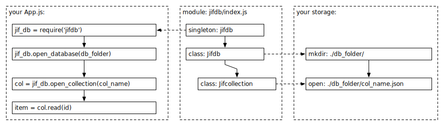

# Jifdb

`Jifdb` is a Promise based JSON.file Database for Node.js applications - a minimal CommonJS module using JSON-file storage and CRUD (Create, Read, Update, Delete) accessors.

_Please note(!):_ 

`I am in the process of developing and testing this module, and adding promises. I also found some bugs. Anyone that wants to use this module probably better wait for 2.x.`

## Design



## Installation

Info on: https://www.npmjs.com/package/jifdb

```
npm install jifdb --save
```

### Usage

```
// do in <app.js> or <index.js>:
const jif_db = require('jifdb');
jif_db.open_database({ db_path: path.join(__dirname, 'jifdb_dir') });

// do in your model/script like <users.js>:
const jif_db = require('jifdb');
let users = jif_db.open_collection({collection_name: "users"});

// CRUD on collection:
const new_user      = users.create({item:{ key1:"value1", key2:"value2" }});
const current_users = users.read();                   // all items in collection
const get_user      = users.read({id:new_user.id});   // read one item

// Jifdb public methods:
Jifdb.open_database({db_path:db_path})
Jifdb.close_database()
Jifdb.open_collection({collection_name: "col_name"}) => returns: a Jifcollection
Jifdb.close_collection({collection_name: "col_name"})
Jifdb.delete_collection({collection_name: "col_name"})

// Jifcollection public methods:
Jifcollection.create({item:{ key1:"value1", key2:"value2" }})
Jifcollection.read({id: id})
Jifcollection.update({id: id})
Jifcollection.delete({id: id})
Jifcollection.save()
```
